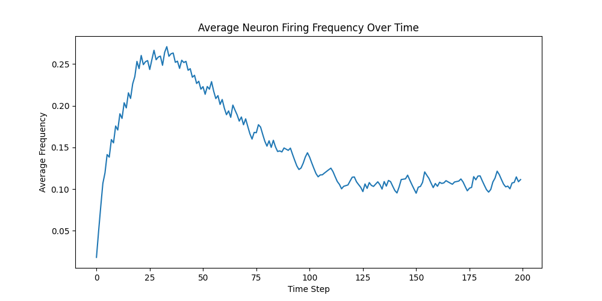
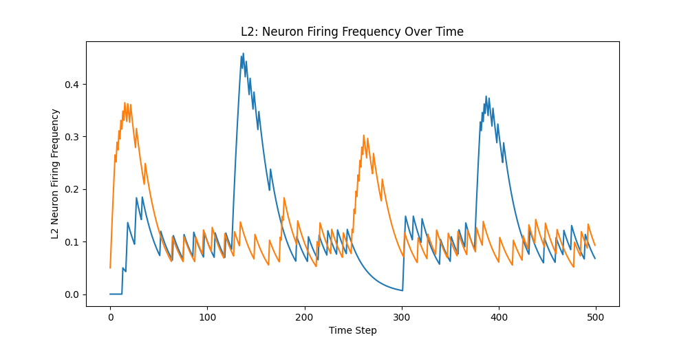

## Temporal hierarchical SOM
In Self organizing maps (SOM) architectures, smooth feature maps are formed by using pixel based pattern similarity. Smooth feature maps are also seen in the brain, and the assumption is that they form using a similar pattern similarity measures, i.e. neighboring neurons are likely to be sensitive to patterns that are similar in their pixel values. For example, in V1, line orientation preference of neurons gradually changes in neighboring neurons (more precisely, cortical columns).

My hypothesis is that this similarity in the maps formed by SOM models and brains is merely coincidental. In the brain, maps are not formed based on pattern similarity, but based on how closely the patterns appear in time. Neighboring neurons become sensitive to consequtive patterns, not pixel similar patterns. It just so happens that in nature, signals change gradually. For example, slowing tilting head makes any visible lines slowly rotate. The maps are formed based on neighbors becoming sensitive consequtive patterns, and so in this case, they become sensitive to similar line angles.

Now, couple the above hypothesis with the observation that in the contex, activation seems to progress in traveling waves and one reaches the deduction that activating neighboring neurons sequentially would trace a input trajectory, for example, represent a line rotating in clockwise or counterclockwise direction.

This is one of the core foundation of Pattern Machine - SOM neighborhood should represent input transition function. The idea is that this is happening at each area in the cortical area functional hierarchy. This means that the common cortical algorithm encodes transition function over cortical surface.

Different areas may have different temporal scales, i.e. how much time after should a neighboring neuron should get activated. It is possible that sensory-motor areas would have a short time constant, i.e. activation travels across these areas fast. Higher order areas may have slower moving traveling waves, representing longer time scale between neighbors. This is a falsifyable prediction.

### Experiment 01
Let's put together a 2 layer system that is mutually fully connected.

    L2     -----
        ^ FC, v FC
    L1 -------------
          ^ 1:1
    S  -------------

- L1 and L2 are the layers and s is the input signal. Both L1 and L2 are made up of LIF neurons.
- S to L1 is 1:1 connection where each signal pixel is connected to a single L1 neuron.
- Each L2 neuron receives input from L1 neurons.
- Each L2 neuron's output is connected back to all L1 neurons. This represents the prediction from L2 coming back to L1. This connection does NOT go to L1 as input. Instead, it modulates the threshold of L1 neurons.

Now, there are two possibilities how prediction affects threshold of L1 neurons.

1. Decrease threshold - This would make predicted neurons fire more, thus "locking in" and completing the currently active signal.
2. Increase threshold - This would effectively subtract prediction from signal and thus would pass to L2 only prediction errors. This is likely to lead to oscillatory dynamics that we are looking for.

#### Experiment 01.01

    L1 -------------
          ^ 1:1
    S  -------------

First, let's create L1 with 5x5 grid of neurons, each receiving a single floating point input from a 5x5 signal S.

S represents firing frequency of the retinal ganglion cells. These cells have a baseline firing rate of 5-20hz, with a max firing rate of 300-500hz. Taking 20hz and 400hz as representative values, mapping 400hz to 1.0, we get baseline input of 20/400=0.05. So we use 1.0 and 0.05 as values for the ON and OFF pixels respectively.

Our input signal is a border of 1px, with the following values -

    tensor([[1.0000, 1.0000, 1.0000, 1.0000, 1.0000],
            [1.0000, 0.0500, 0.0500, 0.0500, 1.0000],
            [1.0000, 0.0500, 0.0500, 0.0500, 1.0000],
            [1.0000, 0.0500, 0.0500, 0.0500, 1.0000],
            [1.0000, 1.0000, 1.0000, 1.0000, 1.0000]])

Results:

- Border neurons start firing at a high rate and over time get AGCed to target frequency
- Non-border neurons do not fire initially. AGC gradually reduces their threshold so they start firing
- Eventually AGC results in almost the same firing rate for all neurons 

This is expected behavior. Video animation showing various network activity is [here](output/01.01/video.html).

#### Experiment 01.02

Now we will add L2 and forward connections from L1.

    L2      --       (2 neurons)
           ^ FC
    L1 -------------
          ^ 1:1
    S  -------------

L2 will have just 2 neurons. One of them sensitive to the pattern that we have using for S. The other neuron will be sensitive to a different pattern.

The connection from L1 to L2 - We will represent these connection weights as floating point numbers between -1 and 1. This will allow us to model expected ON pixels as positive weight, expected OFF pixels as negative weight and irrelevant pixels as values close to 0.

We present pattern1, pattern2, pattern1 and pattern2 for each 25% of total time steps. Expect corresponding neuron in L2 to activate.

Here is a chart showing firing frequency of the 2 L2 neurons.

Notice alternating activation of the neurons. They settle back to background activity despite the pattern continues to be presented.

This is temporal edge detection.