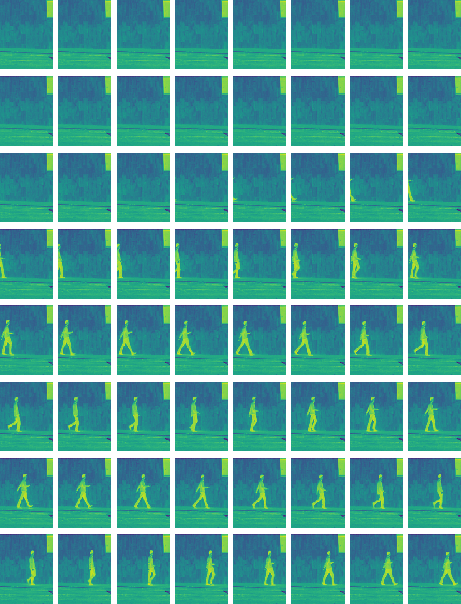
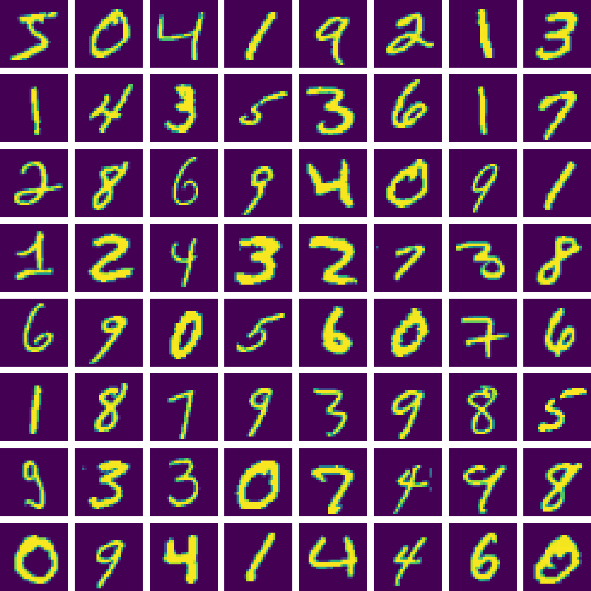
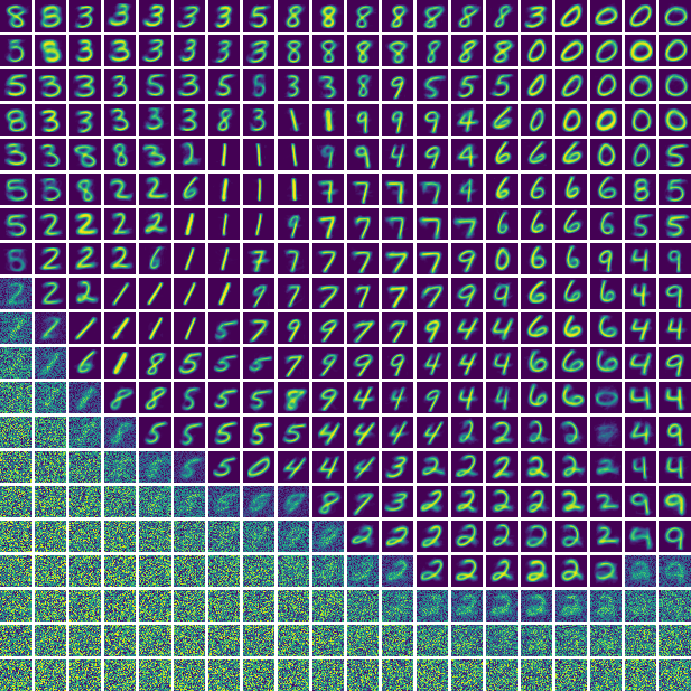
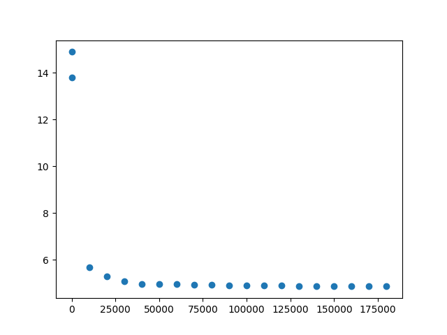

# Engram SOM

Train a SOM model using video frames, such that consecutive winning neurons form curves over the map.

## Experiment 01

Non-spiking basic SOM --> Precision Aware SOM (PA-SOM)
- Show that PA-SOM can split patterns into components
- patterns automatically reject background

### Experiment 01.01
Start with a standard SOM model where smooth neighborhood is achieved by training the neighborhood of the winning neuron. Demonstrate SOM formation with video frames as input.

Results:
- Training images (video frames) 
- SOM patterns 

### Experiment 01.02
Show SOM formation with MNIST images. Measure precision recall.

Results:
- Training images 
- SOM patterns 
- Trained for 3 epochs 
  - Accuracy: 0.9179
  - Precision: 0.9186685528976392
  - Recall: 0.9179
  - F1 Score: 0.9177714073127606

### Experiment 01.03
Add precision awareness. Show effect on MNIST precision, recall, types of patterns formed, etc