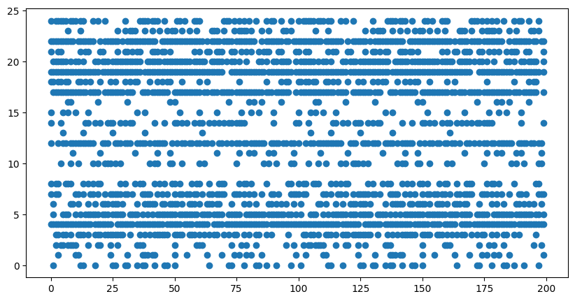
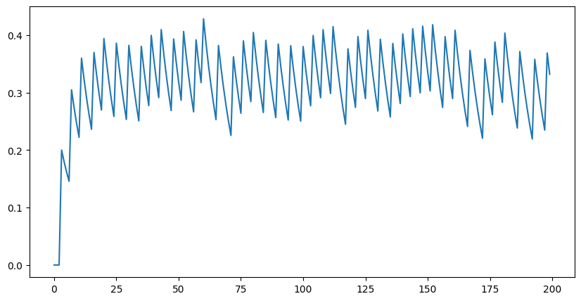

# Pattern machine

*2 Feb 2024*
After doing a bunch of experiments with nanoGPT, I continue to see the need for spiking neurons as a way to convey evidence for a pattern, sparse population code to convey confidence/precision and network dynamics as a way to reconsile bottom up inputs with top down predictions. So, here I am, yet again starting experiments with spiking neurons as a way to build Pattern Machine.

Once again, I am going to attempt to capure the dynamics that, in my opinion, underlie many desirable properties of the brain and a future AGI system.

Three kinds of spike codes are discussed in the literature - rate code, latency and diff. I posit that these three codes are facets of the same underlying code. Yes, larger input current would make a neuron fire more, so rate code makes sense. At the same time, larger input current also makes neurons fire earlier, which represents latency code when we look at the first spike. Predictive coding inhibition would clamp down stable (predictable) neural activity and thus a neuron may appear to fire only on change. Again, just a facet of the same underlying neural code. I wonder whether I should write a paper to explore this point of view, so the field can move on from the debate about which code is the "correct" one.

Coming back to the desirable dynamics discussion, here is the dynamic I am going after. A neuron is driven by bottom up input and top down predictions where the influence of these two signals oscillate out of phase. Towards the start of a cycle, bottom up input drives the neuron and later on in the cycle, top down predictions drive it.

First experiment is to set up a single neuron that demonstrates this cyclic behavior.

Note: The prediction is be for the next time step, i.e. the neuron defines a transition function. Higher layers could have longer time steps and thus drive lower layers to recapituate future trajectories, useful for planning.

## experiment1.py
Tried with nengo. Realized that Node to Node connections are implemented as decoded value, not individual spikes, so not suitable.

## experiment1.1.py
Tried with snnTorch. Custom connections are not clean.

## experiment1.2.py
Build custom spiking neural network framework
(5,5) sensory input connected to (1,1) ensemble
Next, add dynamic gain control (simulate fatigue) by adjusting threshold

## experiment1.3.py
Implemented AGC. Frequency is LI with 0-1 range. Threshold is set to 1+frequency, so 1-2 range.

*Sensory input spikes*

*Firing frequency*

*Output spikes*

Next, set up two neurons with specific input patterns, and show that alternating the input patterns activates them accordingly. That would be a set up for lateral inhibition experiment after that.

## experiment1.4.py
Made first neuron to be sensitive to the sensory input and second neuron sensitive to the exact opposite signal. We can see that the sensitive neuron has significantly higher frequency of firing than the other neuron. In the second half of the simulation, input switches to the opposite signal, and the other neuron fires more.

*Output spikes*

*Output frequency*

This contrast between the two neurons' firing rates should further increase with lateral inhibition, that we will take up in the next experiment.

## experiment1.5.py

Set lateral weights between the two neurons as -1. Now we see that the we get full contrast in the frequency of the two neurons.
* 0-25% steps: Signal that neuron 1 is sensitive to
* 25-50% steps: Signal that neuron 2 is sensitive to
* 50-75% steps: A different signal that one of the two neuron is relatively more sensitive to
* 75-100% steps: White noise.

Note full contrast in first 2 segments. Some contrast in the second segment, and no contrast (same frequency) in the last white noise segment.

Next: Set up top down prediction connections from neurons back to sensory input.

## experiment1.6.py

* Add top down predictions.
* Ensemble gets mixed input = sensory input + top down predictions. Create a "Collector" class to mix signals.
* AGC to achieve target frequency.
* Negative afferent connections to refine patterns.

Experiments runs for 1000 time steps. Each block of 200 time steps gets a different sensory input. The resulting ensemble behavior shows interesting dynamics.

* 0-200: Pattern that neuron 1 is sensitive to.
* 201-400: Pattern that neuron 2 is sensitive to.
* 401-600: No input spikes.
* 601-800: Pattern that a partial pattern (L shape) of neuron 2's pattern (square frame shape).
* 801-1000: Mix of neuron 1 and neuron 2's patterns.

See [Videos](<images/1.6.videos.html>) showing top down prediction and combined (smoothed) input.

Behaviors
* 0-200: Pattern that neuron 1 is sensitive to. Neuron 1 rapidly starts firing, reaching 0.65 frequency, but its threshold gets adjusted such that it settles down to about 0.3 frequency. This shows [spike frequency adaptation](https://www.researchgate.net/figure/Different-Known-types-of-neurons-correspond-to-different-values-of-the-parameters-a-b_fig3_335663585) type activity.

* 201-400: Pattern that neuron 2 is sensitive to. Notice the transition period where neuron 1's activation rapidly declines both due to mismatched input and negative lateral connectivity from neuron 2 as neuron 2 starts firing. While neuron 2 is firing, it clamps down the activity of neuron 1.
* 401-600: No input spikes. This shows [working memory](https://www.frontiersin.org/articles/10.3389/fncel.2021.631485/full) type dynamics. As no sensory input comes in, the ensemble is driven solely through top down activation. Although weak (activation hardly reaches above 0.5), threshold adaptation results in sustained firing. The result is that the last seen pattern (during 201-400) says in working memory until a new pattern wipes it out starting at 600. Although, persistant firing like this [may not](https://www.ncbi.nlm.nih.gov/pmc/articles/PMC6083456/  ) underly working memory in the brain.
* 601-800: Pattern that a partial pattern (L shape) of neuron 2's pattern (square frame shape). This pattern results in neuron 2 getting activited, which sends down neuron 2's pattern as top down prediction. When mixed with sensory input, it "completes" the incomplete sensory pattern, which can be thought of as a demonstration of [illusory contours](https://en.wikipedia.org/wiki/Illusory_contours).

* 801-1000: Mix of neuron 1 and neuron 2's patterns. Here we see neuron 1 and 2 compete for activity via lateral inhibition. This demonstrates [bistable perception](https://www.frontiersin.org/journals/psychology/articles/10.3389/fpsyg.2018.00589/full). 

